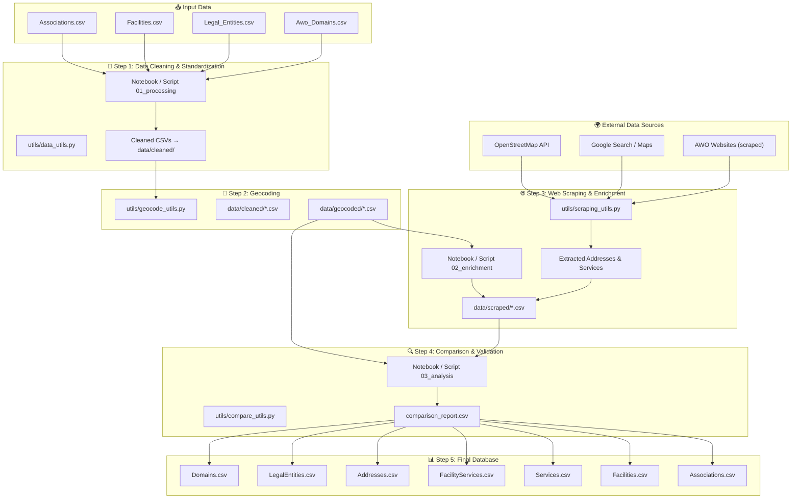
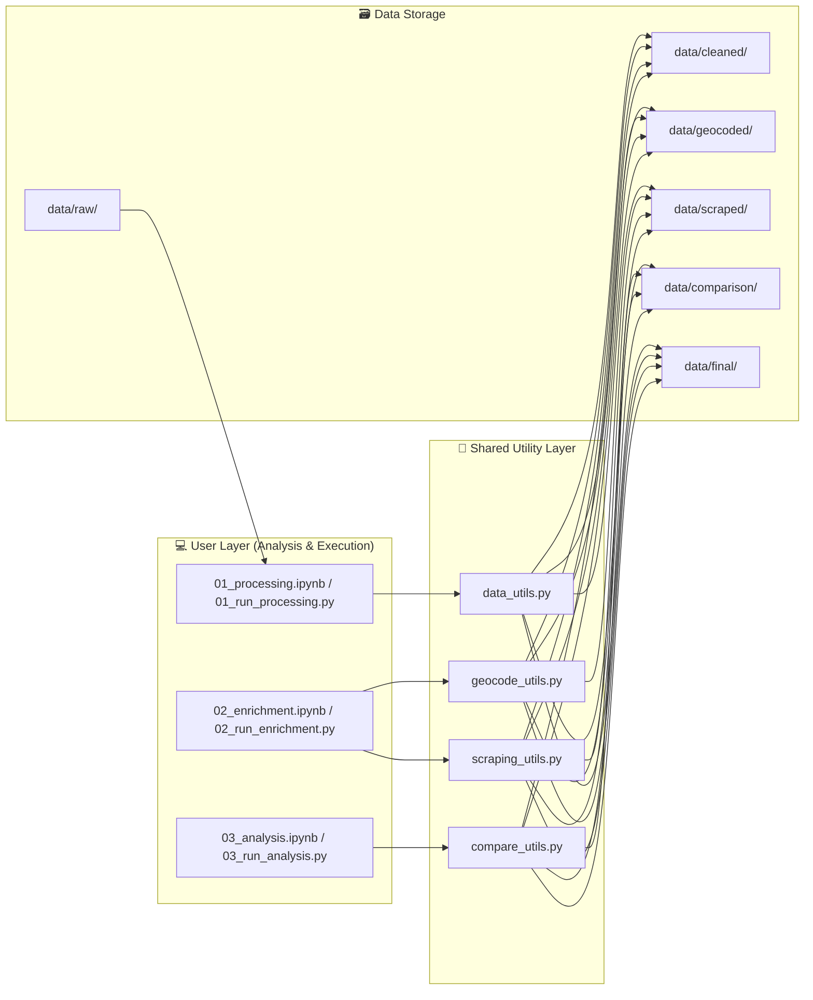
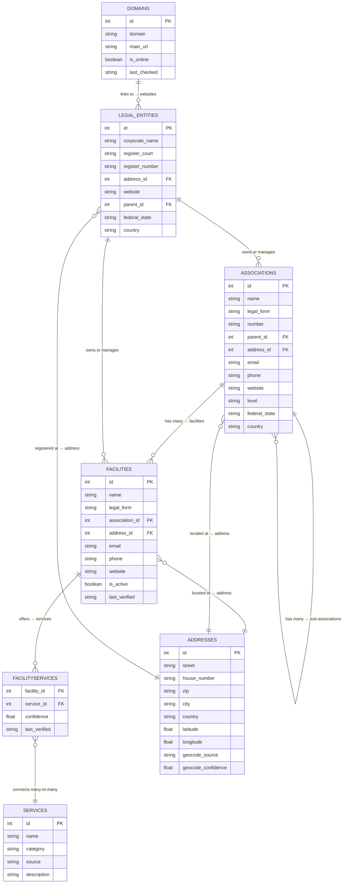

# 🧭 AWO Data Project – Architecture Overview

This document gives an overview of how the **AWO Data Cleaning & Enrichment Project** is structured:  
what data enters the system, how it is processed, which components interact, and what outputs are produced.

---

## 1️⃣ Project Flow Overview

The project processes data in **five main steps** – from raw CSVs to a clean and enriched final database.

---

## 2️⃣ Folder and Script Structure

All code is organized into a simple, reproducible structure.  
Each notebook has a corresponding Python script so that workflows can be automated later.

---

## 3️⃣ Data Model (Final Database)

Below is a simplified ER diagram showing the final database structure after cleaning, geocoding, and enrichment.

---

## 4️⃣ Summary

| Component | Description |
|------------|--------------|
| **data/raw/** | Original AWO tables as provided |
| **data/cleaned/** | Standardized and cleaned versions |
| **data/geocoded/** | Address data enriched with latitude/longitude |
| **data/scraped/** | Scraped information from AWO websites |
| **data/comparison/** | Reports showing mismatches and outdated info |
| **data/final/** | Final deliverables – ready for integration |
| **src/utils/** | Python helper functions used by notebooks & scripts |
| **src/pipelines/** | Reproducible step-by-step processing scripts |
| **src/notebooks/** | Jupyter notebooks for documentation and analysis |

---

📘 *This architecture ensures transparency, modularity, and reproducibility for all contributors — whether they work in notebooks, scripts, or data analysis.*
