# 🧭 AWO Data Project – Architecture Overview

This document gives an overview of how the **AWO Data Cleaning & Enrichment Project** is structured:  
what data enters the system, how it is processed, which components interact, and what outputs are produced.

---

## 1️⃣ Project Flow Overview

The project processes data in **five main steps** – from raw CSVs to a clean and enriched final database.

---

## 2️⃣ Folder and Script Structure

All code is organized into a simple, reproducible structure.  
Each notebook has a corresponding Python script so that workflows can be automated later.

```mermaid
graph LR

subgraph NotebookLayer["💻 User Layer (Analysis & Execution)"]
    N1["01_processing.ipynb / 01_run_processing.py"]
    N2["02_enrichment.ipynb / 02_run_enrichment.py"]
    N3["03_analysis.ipynb / 03_run_analysis.py"]
end

subgraph UtilsLayer["🧩 Shared Utility Layer"]
    U1["data_utils.py"]
    U2["geocode_utils.py"]
    U3["scraping_utils.py"]
    U4["compare_utils.py"]
end

subgraph DataLayer["🗃️ Data Storage"]
    D1["data/raw/"]
    D2["data/cleaned/"]
    D3["data/geocoded/"]
    D4["data/scraped/"]
    D5["data/comparison/"]
    D6["data/final/"]
end

N1 --> U1
N2 --> U2 & U3
N3 --> U4
U1 & U2 & U3 & U4 --> D2 & D3 & D4 & D5 & D6
D1 --> N1
```

---

## 3️⃣ Data Model (Final Database)

Below is a simplified ER diagram showing the final database structure after cleaning, geocoding, and enrichment.

```mermaid
erDiagram
    ASSOCIATIONS {
        int id PK
        string name
        string legal_form
        string number
        int parent_id FK
        int address_id FK
        string email
        string phone
        string website
        string level
        string federal_state
        string country
    }

    FACILITIES {
        int id PK
        string name
        string legal_form
        int association_id FK
        int address_id FK
        string email
        string phone
        string website
        boolean is_active
        string last_verified
    }

    SERVICES {
        int id PK
        string name
        string category
        string source
        string description
    }

    FACILITYSERVICES {
        int facility_id FK
        int service_id FK
        float confidence
        string last_verified
    }

    ADDRESSES {
        int id PK
        string street
        string house_number
        string zip
        string city
        string country
        float latitude
        float longitude
        string geocode_source
        float geocode_confidence
    }

    LEGAL_ENTITIES {
        int id PK
        string corporate_name
        string register_court
        string register_number
        int address_id FK
        string website
        int parent_id FK
        string federal_state
        string country
    }

    DOMAINS {
        int id PK
        string domain
        string main_url
        boolean is_online
        string last_checked
    }

    ASSOCIATIONS ||--o{ FACILITIES : "has many → facilities"
    ASSOCIATIONS ||--o{ ASSOCIATIONS : "has many → sub-associations"
    FACILITIES ||--o{ FACILITYSERVICES : "offers → services"
    FACILITYSERVICES }o--|| SERVICES : "connects many-to-many"
    FACILITIES }o--|| ADDRESSES : "located at → address"
    ASSOCIATIONS }o--|| ADDRESSES : "located at → address"
    LEGAL_ENTITIES }o--|| ADDRESSES : "registered at → address"
    LEGAL_ENTITIES ||--o{ ASSOCIATIONS : "owns or manages"
    LEGAL_ENTITIES ||--o{ FACILITIES : "owns or manages"
    DOMAINS ||--o{ LEGAL_ENTITIES : "links to → websites"
```

---

## 4️⃣ Summary

| Component | Description |
|------------|--------------|
| **data/raw/** | Original AWO tables as provided |
| **data/cleaned/** | Standardized and cleaned versions |
| **data/geocoded/** | Address data enriched with latitude/longitude |
| **data/scraped/** | Scraped information from AWO websites |
| **data/comparison/** | Reports showing mismatches and outdated info |
| **data/final/** | Final deliverables – ready for integration |
| **src/utils/** | Python helper functions used by notebooks & scripts |
| **src/pipelines/** | Reproducible step-by-step processing scripts |
| **src/notebooks/** | Jupyter notebooks for documentation and analysis |

---

📘 *This architecture ensures transparency, modularity, and reproducibility for all contributors — whether they work in notebooks, scripts, or data analysis.*
